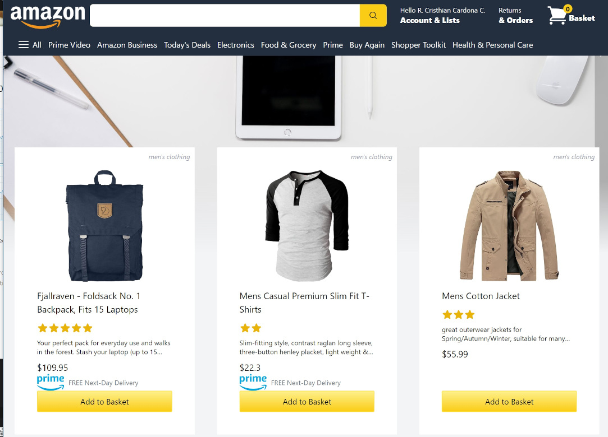

# Amazon 2.0 React

Amazon-like app which retrieves mock products from [Fake Store API](https://fakestoreapi.com/) with [Axios](https://www.npmjs.com/package/axios). It has the functionality to add/remove items to basket, simulate checkout, and save/retrieve orders in a firestore database.

See it in action: https://amazon2-react.vercel.app/

## Screenshots:

  

## Technologies:

The following technologies, dependencies and services were used to implement this app:
- ReactJs.
- NextJs.
- NextAuth for sign in functionality with Google.
- Tailwindcss.
- Firebase.
- Firestore.
- Redux.
- [React Responsive Carousel](https://www.npmjs.com/package/react-responsive-carousel).
- [Fake Store API](https://fakestoreapi.com/), a free online REST API from which mock products are retrieved.
- [Vercel](https://vercel.com/) to host the application.

## Disclaimer 

This is just a demo for testing purposes only and to demonstrate react & Next.js capabilities.

# Installation Steps

## Using npm

Run commands

1. `npm install`

2. `npm run dev`

## Or using yarn

Run commands

1. `npm install --global yarn`

2. `yarn install`

3. `yarn run dev`
